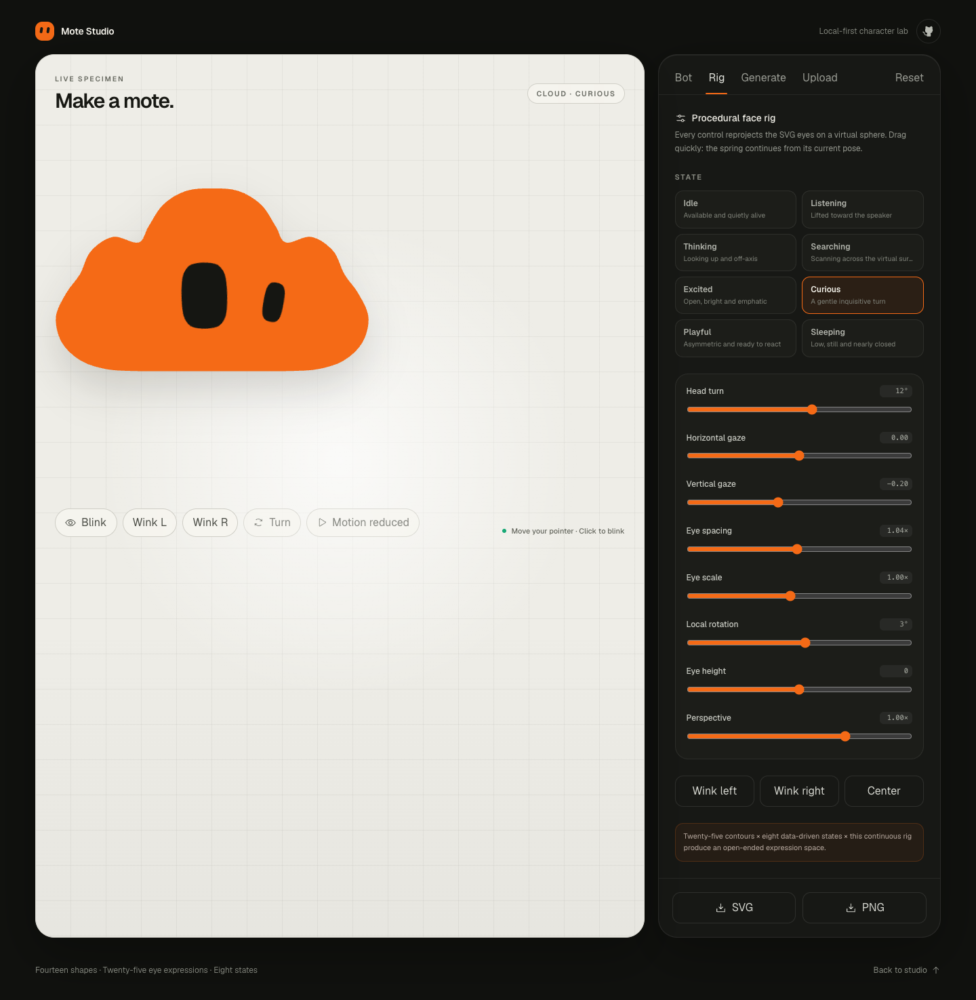
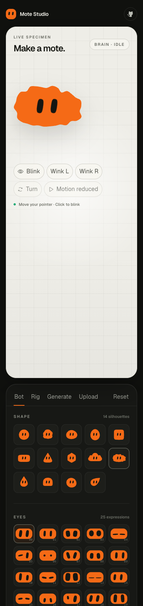

# Mote Studio

Mote Studio is a local-first character lab for designing tiny animated SVG characters. Pick a silhouette, eye expression, and color; generate a combination; add an image texture; then export the result as SVG or PNG.

The interface was built from scratch around a dark tool dock and a bright live canvas. Its motion language is inspired by playful shape studies: spring-based morphs, natural blinking and independent winks, pointer gaze, idle drift, and a continuously editable spherical face rig.



<p align="center">
  
</p>

## Features

- Fourteen curated SVG silhouettes with smooth path morphing
- Twenty-five morphable eye expressions reconstructed from the technical reference
- Eleven contrast-aware colors and adaptive eye color
- Calm, playful, and kinetic motion personalities
- Automatic morph cycle with a visible pause control
- Eight data-driven states with expression pools and state-specific cadence
- Pointer-following gaze, spring-based expression changes, click-to-blink, and independent winks
- A procedural face rig with head turn, gaze, eye spacing, scale, local rotation, height, and perspective controls
- Local image textures with drag-and-drop and inline validation
- Deterministic SVG and 1024 × 1024 PNG export
- Local MCP server for agent-generated, reproducible Motes
- Persistent preferences in browser storage
- Keyboard-operable tabs and controls
- Reduced-motion support and responsive layouts down to 320 px

Uploaded images never leave the browser. Mote Studio has no backend, account system, analytics, or network upload path.

## Stack

- React 19 and TypeScript
- Vite 8
- Tailwind CSS 4
- Motion for React
- Phosphor Icons
- Vitest and Testing Library
- Model Context Protocol TypeScript SDK 2
- Oxlint and Prettier

## Getting started

Requirements: Node.js 22 or newer and npm.

```bash
git clone https://github.com/metaforismo/mote-studio.git
cd mote-studio
npm install
npm run dev
```

Open the local URL printed by Vite.

## Commands

```bash
npm run dev          # Start the development server
npm run test         # Run the test suite once
npm run test:watch   # Run tests in watch mode
npm run lint         # Run Oxlint
npm run format       # Format source and documentation
npm run build        # Type-check and create a production build
npm run check        # Run formatting, lint, tests, and build
npm run mcp:build    # Build the shared core and MCP server
npm run mcp:inspect  # Open the MCP Inspector against the local server
```

## Use with an AI agent

The repository includes a local [Model Context Protocol](https://modelcontextprotocol.io/) server. It exposes the same silhouette, eye-expression, state, palette, procedural rig, motion, and SVG-rendering logic used by the web app, so an agent can create a Mote for another project without scraping the interface.

Available tools:

| Tool                | Purpose                                                                       |
| ------------------- | ----------------------------------------------------------------------------- |
| `list_mote_presets` | Discover shapes, eyes, states, rig poses, colors, motion styles, and defaults |
| `create_mote`       | Generate a reproducible configuration and portable SVG from an optional seed  |
| `render_mote_svg`   | Render an exact configuration as dependency-free inline SVG                   |

Build the server once, then register its absolute path with Codex:

```bash
npm ci
npm run mcp:build
codex mcp add mote-studio -- node /absolute/path/to/mote-studio/packages/mcp/dist/cli.js
codex mcp list
```

For another MCP client, use the equivalent local command configuration:

```json
{
  "mcpServers": {
    "mote-studio": {
      "command": "node",
      "args": ["/absolute/path/to/mote-studio/packages/mcp/dist/cli.js"]
    }
  }
}
```

The MCP process uses standard input/output only for protocol messages. Its three tools are annotated as local, read-only, non-destructive, and closed-world; they do not read files, write files, or make network requests. Generated SVGs validate colors, escape titles, and reject non-image texture data URLs.

## Repository layout

```text
src/             React studio
packages/core/   Shared shapes, presets, generator, and SVG renderer
packages/mcp/    Local stdio MCP server and protocol tests
docs/screenshots README captures generated from the running app
```

## How morphing works

Every silhouette resolves to a closed ring of 32 points and every eye to a 16-point ring in `packages/core`. The path generator converts each family to the same number and order of cubic Bézier commands. Because each SVG command topology stays compatible, Motion can interpolate every `d` attribute directly instead of replacing nodes or crossfading between unrelated shapes. Hand-drawn presets such as Cloud, Brain, Teardrop, and Leaf are redistributed along their perimeter before rendering, preserving lobes and pointed profiles while keeping morphs safe.

The fourteen-shape set was redrawn as code-native geometry after reference-only silhouette studies. Cloud now uses a dominant central crown, soft side lobes, and a grounded baseline; Brain is a separate asymmetric cortical silhouette with edge lobes rather than a wavy capsule. No generated bitmap is included in the application, exports, or package output.

Ambient movement is isolated from body morphing, expression morphing, gaze, blinking, and face turning. The rig follows the supplied reference's spherical projection: each eye travels around a virtual face, compresses with depth, and disappears only when it passes behind the silhouette. All eight rig values are continuous and retarget interruptible springs from the pose already on screen. Twenty-five contours and data-driven state pools make the expression space extensible without adding animation branches. Automatic expression changes run at a restrained, state-specific cadence and stop under `prefers-reduced-motion`. Each layer animates only transforms, opacity, color, or the SVG path itself; layout properties are never animated.

## Accessibility

The studio uses semantic `fieldset` groups, labeled controls, roving keyboard tabs, live announcements, visible focus states, and contrast-tested text. `prefers-reduced-motion` disables ambient movement and automatic morphing while preserving the editing workflow.

## Project status

This is an early, functional release. The public API may evolve before version 1.0.

## License

MIT. See [LICENSE](LICENSE).
